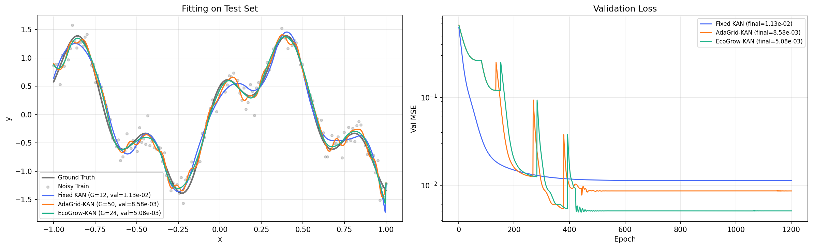
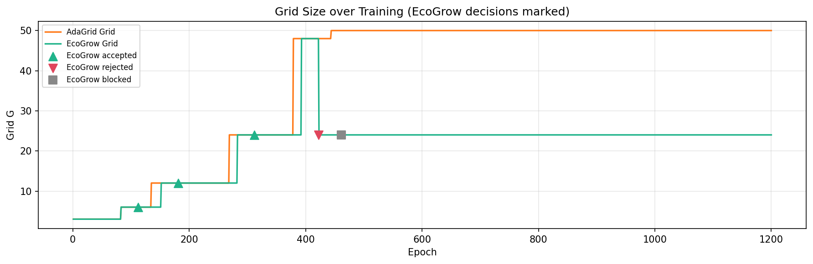

<div align="center">

# AdaGrid-KAN with EcoGrow

### Cost-Aware Reversible Grid Expansion for KAN

[](https://pytorch.org/)
[](LICENSE)
[]()

[Interactive demo](visualization/ecogrow_live_comparison.html) · [EcoGrow comparison script](examples/ecogrow_comparison.py)

</div>

---

## Main idea

**AdaGrid-KAN** automatically increases the B-spline grid when training loss reaches a plateau. **EcoGrow-KAN** extends this idea by asking not only *when* the grid should grow, but whether the growth is actually worth the added **trainable parameters**.

EcoGrow performs trial expansion, evaluates validation improvement and parameter cost, accepts useful growth, rolls back ineffective growth, and **blocks repeated attempts** of the same rejected transition.

> **AdaGrid asks:** “When should the grid grow?”
>
> **EcoGrow additionally asks:** “Was the growth useful, and was it worth the added parameters?”

---

## Why EcoGrow-KAN?

| Approach | Grid behavior | Risk |
|---|---|---|
| **Traditional fixed KAN** | Grid chosen before training | Too small → underfit; too large → wasted parameters |
| **AdaGrid-KAN** | Auto-grows on training plateau | Every expansion is kept, even if validation does not improve |
| **EcoGrow-KAN** | Trial growth + validation check | Ineffective growth is rolled back; rejected paths are remembered |

On noisy 1D regression, AdaGrid may grow all the way to G=50 while EcoGrow can stop earlier with **fewer trainable parameters** and **competitive or better validation error**—depending on the seed and growth trajectory.

---

## How the algorithm works

```text
Training plateau
    ↓
Save current model (deepcopy)
    ↓
Trial grid expansion
    ↓
Train for trial_epochs
    ↓
Measure validation improvement and parameter growth
    ↓
Accept  /  Reject & rollback  /  Block repeated transition
```

**Metrics** (same as `EcoGrowScheduler` in `src/grid_scheduler.py`):

```python
relative_improvement = (val_loss_before - best_trial_val_loss) / val_loss_before
relative_param_growth  = (params_after - params_before) / params_before
efficiency_score       = relative_improvement / relative_param_growth
```

Growth is **accepted** only when **both** thresholds are met:

- `relative_improvement >= min_improvement` (default 0.01)
- `efficiency_score >= min_efficiency` (default 0.05)

Otherwise the model is restored to the pre-trial backup. If the same `(old_grid → new_grid)` transition was already rejected, it is **blocked** once and never retried.

---

## Key results (seed = 42 demonstration)

*This table is one representative run, not a universal guarantee.*

| Method | Final Grid | Trainable Params | Validation MSE |
|---|---:|---:|---:|
| Fixed KAN | 12 | 16 | 1.13e-2 |
| AdaGrid-KAN | 50 | 54 | 8.58e-3 |
| **EcoGrow-KAN** | **24** | **28** | **5.08e-3** |

**EcoGrow vs AdaGrid (seed 42, measured trainable parameters):**

- **48.1%** fewer trainable parameters (28 vs 54)
- **40.8%** lower validation MSE (5.08e-3 vs 8.58e-3)

**EcoGrow event sequence (seed 42):**

```text
3 → 6   accepted
6 → 12  accepted
12 → 24 accepted
24 → 48 rejected (rolled back to G=24)
24 → 48 blocked (once)
final G = 24
```

After ~epoch 460 the grid history stays flat at G=24 with no 24↔48 oscillation.



*EcoGrow fitting and validation-loss comparison (seed 42).*



*Grid history: accepted (▲), rejected (▼), blocked (■).*

---

## Multi-seed robustness

```bash
python examples/ecogrow_comparison.py --seeds 42 43 44 45 46
```

**Aggregate results (five seeds):**

| Metric | Fixed KAN | AdaGrid-KAN | EcoGrow-KAN |
|---|---:|---:|---:|
| Final Grid | 12.0 ± 0.0 | 50.0 ± 0.0 | 19.2 ± 5.9 |
| Trainable Parameters | 16.0 ± 0.0 | 54.0 ± 0.0 | 23.2 ± 5.9 |
| Validation MSE | 1.02e-2 ± 5.6e-4 | 7.79e-3 ± 1.1e-3 | 6.11e-3 ± 3.2e-3 |

**EcoGrow vs AdaGrid (average over five seeds):**

- Trainable parameter reduction: **57.0% ± 10.9%**
- Validation MSE reduction: **21.0% ± 41.3%**

Across five seeds, EcoGrow **consistently reduced trainable parameters**. Its **average** validation MSE was lower than AdaGrid, but the improvement had **high variance** and EcoGrow **did not win on every seed**. This suggests parameter-saving behavior is relatively stable, while generalization benefit depends on optimization trajectory and which growth steps are accepted.

<details>
<summary>Per-seed results</summary>

| Seed | EcoGrow Grid | EcoGrow Params | EcoGrow Val MSE | AdaGrid Grid | AdaGrid Params | AdaGrid Val MSE |
|---:|---:|---:|---:|---:|---:|---:|
| 42 | 24 | 28 | 0.00508 | 50 | 54 | 0.00858 |
| 43 | 12 | 16 | 0.00967 | 50 | 54 | 0.00867 |
| 44 | 24 | 28 | 0.00312 | 50 | 54 | 0.00596 |
| 45 | 24 | 28 | 0.00257 | 50 | 54 | 0.00861 |
| 46 | 12 | 16 | 0.01012 | 50 | 54 | 0.00713 |

</details>

---

## Quick start

```bash
pip install -r requirements.txt

python examples/toy_regression.py
python examples/ab_comparison.py
python examples/ecogrow_comparison.py
python examples/ecogrow_comparison.py --seeds 42 43 44 45 46

pytest -q
```

**Browser demo** (no install):

```bash
visualization/ecogrow_live_comparison.html
# or
cd visualization && python -m http.server 8080
```

---

## Example API (EcoGrow)

```python
from src.kan_layer import DynamicKANLayer
from src.grid_scheduler import EcoGrowScheduler
import torch
import torch.nn.functional as F

model = DynamicKANLayer(in_dim=1, out_dim=1, grid_size=3, spline_order=3)
scheduler = EcoGrowScheduler(
    model, patience=8, max_grid=50,
    trial_epochs=30, min_improvement=0.01, min_efficiency=0.05,
)
optimizer = torch.optim.Adam(model.parameters(), lr=0.03, weight_decay=1e-5)

for epoch in range(num_epochs):
    model.train()
    train_loss = F.mse_loss(model(x_train), y_train)
    optimizer.zero_grad(); train_loss.backward(); optimizer.step()

    model.eval()
    with torch.no_grad():
        val_loss = F.mse_loss(model(x_val), y_val)

    result = scheduler.step(
        train_loss=train_loss.item(),
        val_loss=val_loss.item(),
        epoch=epoch,
    )
    model = result.model  # required after rollback

    if result.optimizer_reset_required:
        optimizer = torch.optim.Adam(model.parameters(), lr=0.03, weight_decay=1e-5)
```

**AdaGrid-only** (original behavior):

```python
from src.grid_scheduler import ExtendGridOnPlateau

scheduler = ExtendGridOnPlateau(model, patience=8, max_grid=50)
refined, events = scheduler.step(train_loss.item(), epoch=epoch)
if refined:
    optimizer = torch.optim.Adam(model.parameters(), lr=0.03)
```

---

## Visualization

[visualization/ecogrow_live_comparison.html](visualization/ecogrow_live_comparison.html) provides a browser-side live comparison of Fixed KAN, AdaGrid-KAN, and EcoGrow-KAN (no install required).

---

## Project structure

```
AdaGrid-KAN/
├── src/
│   ├── __init__.py               # public API exports
│   ├── kan_layer.py              # DynamicKANLayer
│   └── grid_scheduler.py        # ExtendGridOnPlateau + EcoGrowScheduler
├── examples/
│   ├── toy_regression.py
│   ├── ab_comparison.py
│   └── ecogrow_comparison.py
├── tests/
│   ├── test_kan_layer.py         # DynamicKANLayer unit tests
│   └── test_ecogrow_scheduler.py # EcoGrowScheduler unit tests
├── docs/images/
│   ├── ecogrow_comparison.png
│   └── ecogrow_training_history.png
├── visualization/
│   └── ecogrow_live_comparison.html
├── .github/workflows/
│   └── ci.yml                   # GitHub Actions CI (Python 3.10/3.11/3.12)
├── LICENSE
├── pyproject.toml
└── requirements.txt
```

---

## Design limitations

- Experiments focus on **one-dimensional regression** with synthetic noise (`noise_std=0.15` by default).
- Trial expansion requires **extra short-term training** each time growth is attempted.
- Rollback and trial growth **rebuild the optimizer** when parameter shapes change.
- Results depend on thresholds (`trial_epochs`, `min_improvement`, `min_efficiency`, `patience`).
- Multi-seed runs show **stable parameter savings** but **variable validation improvement**.
- Broader claims would require more datasets, architectures, and baselines.

This is an **undergraduate open-source engineering project**, not a claim of state-of-the-art performance.

---

## Reproducibility

| Item | Value |
|---|---|
| Default seed | 42 |
| Multi-seed command | `--seeds 42 43 44 45 46` |
| Training noise | `--noise-std 0.15` (CLI) |
| Epochs | 1200 (CLI) |
| Output images | `ecogrow_comparison.png`, `ecogrow_training_history.png` (also under `docs/images/`) |
| Parameter counts | `count_trainable_parameters()` on `requires_grad` tensors |

---

## Tuning (AdaGrid / EcoGrow)

| Parameter | Default | Role |
|---|---:|---|
| `patience` | 8 | Plateau detection |
| `max_grid` | 50 | Grid upper bound |
| `trial_epochs` | 30 | EcoGrow trial length |
| `min_improvement` | 0.01 | Min validation gain to accept |
| `min_efficiency` | 0.05 | Min efficiency score to accept |
| `lr` | 0.03 | Adam learning rate |

---

<br>

<div align="center">

---

# 中文版

### 面向 KAN 的代价感知可逆 Grid 扩容

**仅在验证集改善足以抵消新增参数成本时，才扩大样条 Grid。**

[浏览器实时对比](visualization/ecogrow_live_comparison.html) · [EcoGrow 对比脚本](examples/ecogrow_comparison.py)

---

</div>

## 核心思想

**AdaGrid-KAN** 在训练 loss 达到 plateau 时自动增大 B-spline Grid。**EcoGrow-KAN** 在此基础上进一步追问：这次扩容是否值得新增的**可训练参数**？

EcoGrow 的流程是：试探性扩容 → 评估验证集改善与参数成本 → 接受有效扩容 → 回退无效扩容 → **阻止重复尝试**已被拒绝的扩容路径。

> **AdaGrid 问：**「什么时候该扩容？」
>
> **EcoGrow 还会问：**「这次扩容有用吗？新增参数是否值得？」

---

## 为什么需要 EcoGrow？

| 方法 | Grid 行为 | 风险 |
|---|---|---|
| **传统固定 KAN** | 训练前选定 Grid | 太小欠拟合；太大浪费参数 |
| **AdaGrid-KAN** | 训练 plateau 时自动生长 | 每次扩容都保留，即使验证集未改善 |
| **EcoGrow-KAN** | 试探扩容 + 验证集评估 | 无效扩容回退；拒绝路径被记忆 |

在含噪声的一维回归中，AdaGrid 可能一直长到 G=50，而 EcoGrow 可能更早停在更小的 Grid 上，用**更少的可训练参数**获得**相近或更好的验证误差**——具体取决于随机种子与扩容轨迹。

---

## 算法流程

```text
训练 loss 达到 plateau
    ↓
保存当前模型（deepcopy）
    ↓
试探性增大 Grid
    ↓
训练 trial_epochs 轮
    ↓
计算验证集改善率与参数增长率
    ↓
接受 / 拒绝并回退 / 阻止重复尝试
```

**核心指标**（与 `src/grid_scheduler.py` 中 `EcoGrowScheduler` 一致）：

```python
relative_improvement = (val_loss_before - best_trial_val_loss) / val_loss_before
relative_param_growth  = (params_after - params_before) / params_before
efficiency_score       = relative_improvement / relative_param_growth
```

仅当**同时满足**以下阈值时才接受扩容：

- `relative_improvement >= min_improvement`（默认 0.01）
- `efficiency_score >= min_efficiency`（默认 0.05）

否则恢复扩容前备份。若同一条 `(old_grid → new_grid)` 路径已被拒绝，则**blocked 一次**，不再重试。

---

## 主要结果（seed = 42 演示）

*下表为一次代表性运行，并非普遍保证。*

| 方法 | 最终 Grid | 可训练参数 | 验证 MSE |
|---|---:|---:|---:|
| Fixed KAN | 12 | 16 | 1.13e-2 |
| AdaGrid-KAN | 50 | 54 | 8.58e-3 |
| **EcoGrow-KAN** | **24** | **28** | **5.08e-3** |

**EcoGrow vs AdaGrid（seed 42，以可训练参数为准）：**

- 可训练参数减少 **48.1%**（28 vs 54）
- 验证 MSE 降低 **40.8%**（5.08e-3 vs 8.58e-3）

**EcoGrow 事件序列（seed 42）：**

```text
3 → 6   accepted（接受）
6 → 12  accepted
12 → 24 accepted
24 → 48 rejected（拒绝并回退至 G=24）
24 → 48 blocked（阻止，仅记录一次）
最终 G = 24
```

约 epoch 460 之后，Grid 曲线稳定在 G=24，不再出现 24↔48 振荡。


*seed 42：拟合曲线与验证 loss 对比。*


*Grid 历史：accepted（▲）· rejected（▼）· blocked（■）。*

---

## 多种子稳健性

```bash
python examples/ecogrow_comparison.py --seeds 42 43 44 45 46
```

**五种子汇总：**

| 指标 | Fixed KAN | AdaGrid-KAN | EcoGrow-KAN |
|---|---:|---:|---:|
| 最终 Grid | 12.0 ± 0.0 | 50.0 ± 0.0 | 19.2 ± 5.9 |
| 可训练参数 | 16.0 ± 0.0 | 54.0 ± 0.0 | 23.2 ± 5.9 |
| 验证 MSE | 1.02e-2 ± 5.6e-4 | 7.79e-3 ± 1.1e-3 | 6.11e-3 ± 3.2e-3 |

**EcoGrow vs AdaGrid（五种子平均）：**

- 可训练参数减少：**57.0% ± 10.9%**
- 验证 MSE 降低：**21.0% ± 41.3%**

在五种子实验中，EcoGrow **持续减少了可训练参数**；**平均**验证 MSE 低于 AdaGrid，但改善**方差较大**，且**并非每个种子都更优**。这说明「省参数」相对稳定，而泛化收益取决于优化轨迹与哪些扩容被接受。

<details>
<summary>逐种子明细</summary>

| Seed | EcoGrow Grid | EcoGrow 参数 | EcoGrow Val MSE | AdaGrid Grid | AdaGrid 参数 | AdaGrid Val MSE |
|---:|---:|---:|---:|---:|---:|---:|
| 42 | 24 | 28 | 0.00508 | 50 | 54 | 0.00858 |
| 43 | 12 | 16 | 0.00967 | 50 | 54 | 0.00867 |
| 44 | 24 | 28 | 0.00312 | 50 | 54 | 0.00596 |
| 45 | 24 | 28 | 0.00257 | 50 | 54 | 0.00861 |
| 46 | 12 | 16 | 0.01012 | 50 | 54 | 0.00713 |

</details>

---

## 快速开始

```bash
pip install -r requirements.txt

python examples/toy_regression.py
python examples/ab_comparison.py
python examples/ecogrow_comparison.py
python examples/ecogrow_comparison.py --seeds 42 43 44 45 46

pytest -q
```

**浏览器演示**（无需安装）：

```bash
visualization/ecogrow_live_comparison.html
# 或
cd visualization && python -m http.server 8080
```

---

## API 示例（EcoGrow）

```python
from src.kan_layer import DynamicKANLayer
from src.grid_scheduler import EcoGrowScheduler
import torch
import torch.nn.functional as F

model = DynamicKANLayer(in_dim=1, out_dim=1, grid_size=3, spline_order=3)
scheduler = EcoGrowScheduler(
    model, patience=8, max_grid=50,
    trial_epochs=30, min_improvement=0.01, min_efficiency=0.05,
)
optimizer = torch.optim.Adam(model.parameters(), lr=0.03, weight_decay=1e-5)

for epoch in range(num_epochs):
    model.train()
    train_loss = F.mse_loss(model(x_train), y_train)
    optimizer.zero_grad(); train_loss.backward(); optimizer.step()

    model.eval()
    with torch.no_grad():
        val_loss = F.mse_loss(model(x_val), y_val)

    result = scheduler.step(
        train_loss=train_loss.item(),
        val_loss=val_loss.item(),
        epoch=epoch,
    )
    model = result.model  # 回退后必须更新引用

    if result.optimizer_reset_required:
        optimizer = torch.optim.Adam(model.parameters(), lr=0.03, weight_decay=1e-5)
```

**仅 AdaGrid**（原有行为）：

```python
from src.grid_scheduler import ExtendGridOnPlateau

scheduler = ExtendGridOnPlateau(model, patience=8, max_grid=50)
refined, events = scheduler.step(train_loss.item(), epoch=epoch)
if refined:
    optimizer = torch.optim.Adam(model.parameters(), lr=0.03)
```

---

## 可视化

[visualization/ecogrow_live_comparison.html](visualization/ecogrow_live_comparison.html) 提供 Fixed KAN、AdaGrid-KAN 与 EcoGrow-KAN 的浏览器内实时三方对比（无需安装）。

---

## 项目结构

```
AdaGrid-KAN/
├── src/
│   ├── __init__.py               # 公共 API 导出
│   ├── kan_layer.py              # DynamicKANLayer
│   └── grid_scheduler.py        # ExtendGridOnPlateau + EcoGrowScheduler
├── examples/
│   ├── toy_regression.py
│   ├── ab_comparison.py
│   └── ecogrow_comparison.py
├── tests/
│   ├── test_kan_layer.py         # DynamicKANLayer 单元测试
│   └── test_ecogrow_scheduler.py # EcoGrowScheduler 单元测试
├── docs/images/
│   ├── ecogrow_comparison.png
│   └── ecogrow_training_history.png
├── visualization/
│   └── ecogrow_live_comparison.html
├── .github/workflows/
│   └── ci.yml                   # GitHub Actions CI（Python 3.10/3.11/3.12）
├── LICENSE
├── pyproject.toml
└── requirements.txt
```

---

## 设计局限

- 实验聚焦**一维回归**与合成噪声（默认 `noise_std=0.15`）。
- 试探扩容需要**额外短期训练**。
- 回退与扩容会**重建 optimizer**（参数形状变化时）。
- 结果依赖阈值（`trial_epochs`、`min_improvement`、`min_efficiency`、`patience`）。
- 多种子显示**参数节省较稳定**，**验证改善方差较大**。
- 更广泛结论需要更多数据集与基线。

本项目为**本科生开源课程工程**，不声称 SOTA 或「全球首创」。

---

## 可复现性

| 项目 | 值 |
|---|---|
| 默认种子 | 42 |
| 多种子命令 | `--seeds 42 43 44 45 46` |
| 训练噪声 | `--noise-std 0.15` |
| 训练轮数 | 1200（CLI 可调） |
| 输出图片 | `ecogrow_comparison.png`、`ecogrow_training_history.png`（副本在 `docs/images/`） |
| 参数量统计 | `count_trainable_parameters()`（`requires_grad=True` 的张量） |

---

## 调参建议

| 参数 | 默认值 | 说明 |
|---|---:|---|
| `patience` | 8 | plateau 检测 |
| `max_grid` | 50 | Grid 上限 |
| `trial_epochs` | 30 | EcoGrow 试用期 |
| `min_improvement` | 0.01 | 接受扩容的最小验证改善 |
| `min_efficiency` | 0.05 | 接受扩容的最小效率分数 |
| `lr` | 0.03 | Adam 学习率 |

---

<div align="center">
  <sub>Made for the KAN community · Licensed under MIT</sub>
</div>
